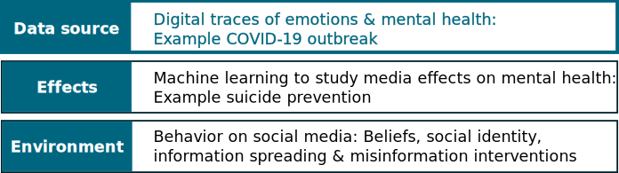
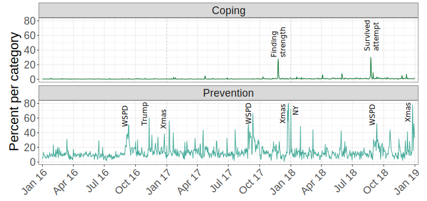
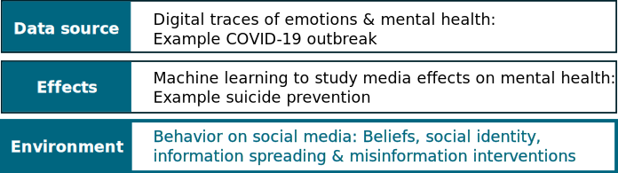
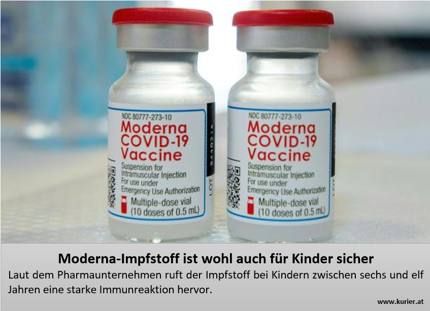
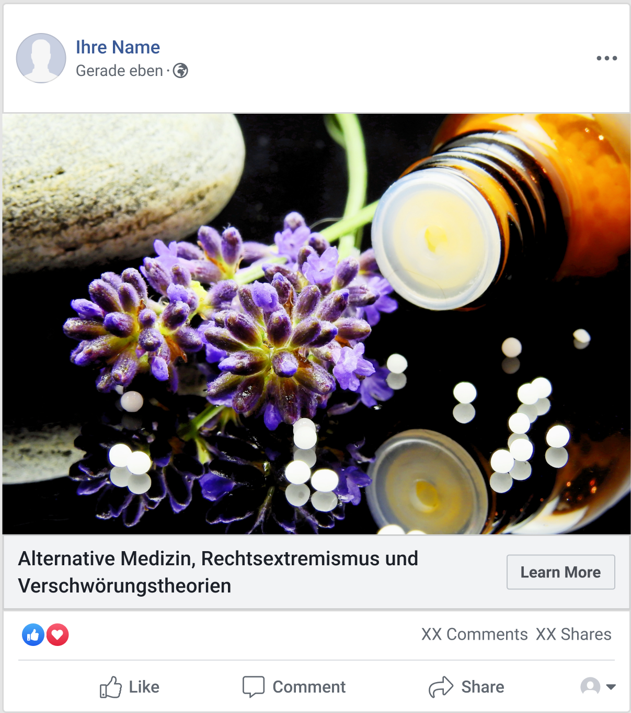

```{r xaringan-themer, include=FALSE, warning=FALSE}
# #This block contains the theme configuration for the CSS lab slides style
library(xaringanthemer) #
library(showtext)
style_mono_accent(
  base_color = "#1f5c99",
  text_font_size = "1.5rem",
  header_font_google = google_font("Raleway"),#("Yanone Kaffeesatz"),
  text_font_google   = google_font("Arial", "300", "300i"),
  code_font_google   = google_font("Fira Mono")
)
```

```{r setup, include=FALSE}
options(htmltools.dir.version = FALSE)
```

layout: true

---
class: inverse, center, middle, title-slide
background-image: url(figures/brain.png)
background-size: contain

# Studying emotions, mental health and social behavior via social media
## Dr. Hannah Metzler
### 13.10.2023 - University of Vienna
#### Slides: www.hannahmetzler.eu/HMResearchSummary


---
layout: true

---

# My background

.left-column[
```{r, echo=FALSE, out.width=200, fig.align='center'}
knitr::include_graphics("figures/uniwien.jpg")
```
```{r, echo=FALSE, out.width=220, fig.align='center'}
knitr::include_graphics("figures/ens_sorbonne.svg")
```

```{r, echo=FALSE, out.width=110, fig.align='center'}
knitr::include_graphics("figures/knowcenter2.svg")
```
<br>
```{r, echo=FALSE, out.width=190, fig.align='center'}
knitr::include_graphics("figures/csh.png")
```
```{r, echo=FALSE, out.width=210, fig.align='center'}
knitr::include_graphics("figures/Meduni-wien.svg")
```
]

.right-column[.center-right[
* Master in Psychology
* <span style="font-size: 25px; font-style: italic">Emotional, hormonal & neural gender differences in stress responses</span> <br> <br>
* PhD in Social & Affective Neuroscience
* <span style="font-size: 25px; font-style: italic">The influence of bodily actions on social perception & behaviour <br> <br>
* Postdoc & Project Manager in Open Science <br> <br> <br>
* Postdoc in Computational Social Science
* Project-PI since November 2021
* <span style="font-size: 25px; font-style: italic">Social media, emotions, mental health, misinformation</span>
]]

---

<!-- --- -->
<!-- layout: true -->
<!-- <div class="my-footer"><span> -->
<!-- <a href="https://psyarxiv.com/t8mhw"> Metzler et al. Psyarxiv (2020) - </a> -->
<!-- <a href="https://rdcu.be/8Gx5"> Chadwick*, Metzler* et al. Motivation & Emotion (2019) - </a> -->
<!-- <a href="https://peerj.com/articles/6726"> Metzler & Grèzes. PeerJ (2019)</a> -->
<!-- </span></div> -->

<!-- --- -->

<!-- # Emotions in non-verbal social interaction -->

<!-- .right-column[.center-right[ -->
<!-- ```{r, echo=FALSE, out.width=700} -->
<!-- knitr::include_graphics("figures/nonverbal.jpg") -->
<!-- ``` -->
<!-- ]] -->

<!-- -- -->

<!-- .left-column[ -->
<!-- **Emotions** -->
<!-- - attract & direct attention -->

<!-- - affect behavior -->

<!-- <br> -->

<!-- Open Science! -->
<!-- ] -->

---
layout: true

---

# My research in the area of social media

<br><br>

```{r, echo=FALSE, out.width=1100, fig.align='center'}
knitr::include_graphics("figures/framework.svg")
```

???
My research in the last 3 years has revolved on social media as research tool, as well as a research topic. I want to briefly present 3 research projects to you, in which I focused on social media in one of three different ways: a digital tool to measure behaviors that could not otherwise be measured, a digital media that has effects on real world behavior, and finally, an new kind of social environment: interaction with large amounts of people, opportunity of observing many others, group identities are salient, mediated by platform design and algorithms.


---

# Social media as a data source

<br><br>

```{r, echo=FALSE, out.width=1100, fig.align='center'}

```

---
layout: true
<div class="my-footer"><span>
<a href="https://psyarxiv.com/qejxv"> Metzler, Rimé, Pellert, Niederkrotenthaler, Di Natale & Garcia (2023) Emotion. </a></span></div>

---

# Collective emotions during COVID-19

.pull-left[.center-left[
**Social media data**
* Emotional expressions on Twitter
* 5 weeks after outbreak in 2020
* 8,3 billion tweets in 6 languages
* Geolocation: 18 countries

**Computational Methods**
* Automated text-analysis
* Validated emotion dictionaries
* Robustness: Machine Learning
* Generalized multilevel modeling: <br>*p(emo) ~ time + (country|time)*
]]

.pull-right[

```{r, echo=FALSE, out.width=600}
knitr::include_graphics("figures/EmotionTimelines2020_Italy.svg")
```
]


???

ML: Deep learning: RoBERTa fine-tuned to tweets
Generalized mixed-effects logistic regression models - 
Fixed-effect coefficients: 
Common effects across countries
After image: link to stringency and cases in plot: association with real world events

---

# Stringency of measures & COVID cases

.pull-left[.center-left[
```{r, echo=FALSE, out.width=460}
knitr::include_graphics("figures/stringency_periods.svg")
```
]]

.pull-right[.center-right[
```{r, echo=FALSE, out.width=440}
knitr::include_graphics("figures/correlation_anx_cases_week1.svg")
```
]]

---
layout: true
<div class="my-footer"><span>
<a href=https://arxiv.org/abs/2107.13236> Garcia, Pellert, Lasser, Metzler. arXiv (2021) - </a>
<a href=https://www.nature.com/articles/s41598-022-14579-y> Pellert, Metzler, Matzenberger & Garcia. Scientific Reports (2022) </a></span></div>

---

# Real-world effects of social media

<br><br>

```{r, echo=FALSE, out.width=1100, fig.align='center'}
knitr::include_graphics("figures/framework_effects.svg")
```

---
layout: true
<div class="my-footer"><span> 
<a href="https://www.jmir.org/2022/8/e34705"> Metzler, Baginski, Niederkrotenthaler & Garcia (2022) JMIR </a></span></div>

---

# Media effects research on suicide

News reporting on suicide influences suicidal behavior in individuals at risk

.pull-left[.center-left[
```{r, echo=FALSE, out.width=250, fig.align='center'}
knitr::include_graphics("figures/Werther.png")
```

<div style="text-align:center">
Reports on suicide deaths: <br>
<span style="font-weight: bold; color:#1f5c99"> Werther</span> effect <br>
<font size="4">
<a href='https://www.bmj.com/content/368/bmj.m575'> Meta-analysis: Niederkrotenthaler et al. 2020 </a>
</font> </div>

]]

.pull-right[.center-right[

```{r, echo=FALSE, out.width=200, fig.align='center'}
knitr::include_graphics("figures/Papageno.png")
```

<div style="text-align:center">
Stories of hope & coping: <br> 
<span style="font-weight: bold; color:#1f5c99"> Papageno</span> effect  <br> 
<font size="4">
<a href='https://www.doi.org/10.1192/bjp.bp.109.074633'> (e.g. ) Niederkrotenthaler et al. 2010 </a>
</font> </div>
]]

<div style="text-align:center; font-weight: bold; color:#1f5c99"> Content, language & emotional connotation matter </div>

---


## Machine learning classification of harmful & protective content

.pull-left[
* Social media content on suicide
* Big data for robust results
* 14.5 million US tweets 2013-2020
]
--
.pull-right[
* Scheme: content categories
* Machine Learning to automatically label tweets
]

--
```{r, echo=FALSE, out.width=1000, fig.align='center'}
knitr::include_graphics("figures/MLresults_per_category.svg")
```

???
Social media: young adults and new content types, but few studies
Small datasets with manual labelling: Big data
Best performance with BERT
* Prevention: Model detects 90%
* Suicidal thoughts: Model misses many - sarcastic messages

---
layout: true
<div class="my-footer"><span> 
<a href="https://doi.org/10.1177/00048674221126649"> Niederkrotenthaler, Tran, Baginski,..., & Metzler (2023). Australian & New Zealand Journal of Psychiatry. </a></span></div>

---

## Associations with suicides & helpline calls in the US

Daily % of all suicide-related tweets 2016-2018


```{r, echo=FALSE, out.width=700, fig.align='left'}

```

* Time series analysis with daily suicide cases & helpline calls
* Protective associations: Coping stories & prevention tweets


---
layout:true

---

## Social media as a digital social environment

<br><br>

```{r, echo=FALSE, out.width=1000, fig.align='center'}

```

---
layout: true
<div class="my-footer"><span> 
<a href="www.hannahmetzler.eu/emomis"> Emomis project website </a></span></div>

---


# Emotional misinformation spreading

```{r, echo=FALSE, out.width=400}

```
```{r, echo=FALSE, out.width=300}
knitr::include_graphics("figures/pexels-alex-green-5699823.jpg")
```

.left-column[
<span style="font-size: 25px">Digital Humanism project - 400k <br>
12/2021 - 02/2025</span>
```{r, echo=FALSE, out.width=300}
knitr::include_graphics("figures/wwtf.svg")
```
]

.right-column[
* Emotions attract attention & increase sharing

* Polarized group discussions on social media

* Beliefs are shaped by our social identity
]

???
* Current interventions focus on accuracy <br>

---

## Socio-emotional processes: Health misinformation

```{r, echo=FALSE, out.width=1100, fig.align='left'}
knitr::include_graphics("figures/Emomis.svg")
```

---
layout: true
<div class="my-footer"><span>
<a href=https://doi.org/10.31234/osf.io/udqms> Lühring, J., Shetty, A., ..., Metzler, H. (2023). PsyarXiv (2023)</a></span></div>

---

## Emotions = Irrationality & manipulation?

* Replication & extension of [Martel et al. (2020)](https://doi.org/10.1186/s41235-020-00252-3")
* Pre-registered online survey in Austria in Dec 2021
* Actual false & real COVID-19 news items (n=24): accuracy rating task
* Emotional state & response to each item

<center>
```{r, echo=FALSE, out.height=270}
knitr::include_graphics("figures/N15.PNG")
```
```{r, echo=FALSE, out.height=270}

```

---

## Angry responses driven by people recognizing lies

```{r, echo=FALSE, out.width=800, fig.align='center'}
knitr::include_graphics("figures/curvi-linear.svg")
```

* Higher anger in people **good & bad** at recognizing false news
* Angry responses because most people **recognize** false news
* Emotions arise when information contradicts beliefs rooted in social identity

<div style="color:grey"><small><left>
Robust polynomial curves for news discernment & emotional responses. </small>
</div>

---
layout:true

---

## Pilotstudy: Beliefs incongruent with social identity

.left-column[
```{r, echo=FALSE}

```
]

.right-column[

* People sympathizing with alternative medicine

* Intervention: 
  * History of right-wing extremist support
  * News articles from right-wing website
  
* Pre-post: Sympathy and trust ratings
  
**=> Highlighting that current beliefs contradicts an <br>
important social identity reduces trust in <br> 
alternative medicine (r=0.6)**
]

---
layout:true
<div class="my-footer"><span>
<a href=https://journals.sagepub.com/doi/10.1177/17456916231185057> Metzler & Garcia (2023). Perspectives on Psychological Science (2023)</a></span></div>

---

## Digital media effects on well-being, fake news & polarization?

* Social media & its algorithms as the culprit for large societal issues

* Social interaction networks vs. recommendation algorithms

* Evidence: algorithms mostly reinforce existing social drivers of these problems

* Ideas for future research on platform design & algorithms that support well-being, and societal collaboration

---

## Relevant skills for the health psychology group

.pull-left[.center-left[

### Quantitative methods

* Automated-text analysis

* Multilevel modeling & <br> longitutinal data

* Coding (R, Matlab, Python)

* Experimental design

* Online experiments
]]

.pull-right[.center-right[

### Research topics

* Social media and mental health

* Media content effects on real-world behavior

* Misinformation interventions

* Leveraging social identity to increase receptivity to corrective health information

]]

---
layout: true

---

# Thank you!

<br> 

For more on my research: https://hannahmetzler.eu

For data and code: https://github.com/hannahmetzler

Slides: https://hannahmetzler.eu/HMResearchSummary

<br>

```{r, echo=FALSE, out.width=220}
knitr::include_graphics("figures/csh.png")
```
```{r, echo=FALSE, out.width=220}
knitr::include_graphics("figures/Meduni-wien.svg")
```
```{r, echo=FALSE, out.width=300}
knitr::include_graphics("figures/wwtf.svg")
```
```{r, echo=FALSE, out.width=260}
knitr::include_graphics("figures/vibrant.svg")
```


???

<!-- --- -->
<!-- class: inverse, center, middle, title-slide -->
<!-- background-image: url(figures/brain.png) -->
<!-- background-size: contain -->

<!-- # Research Summary Hannah Metzler -->
<!-- # Additional slides -->

<!-- --- -->

<!-- # Validity of emotion measures -->

<!-- .pull-left[.center-left[ -->
<!-- * UK Twitter data -->
<!-- * YouGov: Weekly representative UK emotion survey -->
<!-- * 2 year period -->

<!-- * Automated text-analysis & Machine Learning -->
<!-- * Pre-registered hypotheses for prediction period -->
<!-- ]] -->
<!-- .pull-right[.center-right[ -->
<!-- ```{r, echo=FALSE, out.width=650, fig.align='right'} -->
<!-- knitr::include_graphics("figures/Anxiety.svg") -->
<!-- ``` -->

<!-- ```{r, echo=FALSE, out.width=650, fig.align='right'} -->
<!-- knitr::include_graphics("figures/Sadness.svg") -->
<!-- ``` -->
<!-- ]] -->

<!-- * Sentiment analysis in Austria: similar results -->

