```{r xaringan-themer, include=FALSE, warning=FALSE}
# #This block contains the theme configuration for the CSS lab slides style
library(xaringanthemer) #
library(showtext)
style_mono_accent(
  base_color = "#1f5c99",
  text_font_size = "1.5rem",
  header_font_google = google_font("Raleway"),#("Yanone Kaffeesatz"),
  text_font_google   = google_font("Arial", "300", "300i"),
  code_font_google   = google_font("Fira Mono")
)
```

```{r setup, include=FALSE}
options(htmltools.dir.version = FALSE)
```

layout: true

---
class: inverse, center, middle, title-slide
background-image: url(figures/brain.png)
background-size: contain

# Studying emotions, mental health and social behavior via social media
## Dr. Hannah Metzler
### 13.10.2023 - University of Vienna
#### Slides: www.hannahmetzler.eu/HMResearchSummary


---
layout: true

---

# My background

.left-column[
```{r, echo=FALSE, out.width=200, fig.align='center'}

```
```{r, echo=FALSE, out.width=220, fig.align='center'}

```

```{r, echo=FALSE, out.width=110, fig.align='center'}

```
<br>
```{r, echo=FALSE, out.width=190, fig.align='center'}
knitr::include_graphics("figures/csh.png")
```
```{r, echo=FALSE, out.width=210, fig.align='center'}

```
]

.right-column[.center-right[
* Master in Psychology
* <span style="font-size: 25px; font-style: italic">Emotional, hormonal & neural gender differences in stress responses</span> <br> <br>
* PhD in Social & Affective Neuroscience
* <span style="font-size: 25px; font-style: italic">The influence of bodily actions on social perception & behaviour <br> <br>
* Postdoc & Project Manager in Open Science <br> <br> <br>
* Postdoc in Computational Social Science
* Project-PI since November 2021
* <span style="font-size: 25px; font-style: italic">Social media, mental health, misinformation</span>
]]

---

<!-- --- -->
<!-- layout: true -->
<!-- <div class="my-footer"><span> -->
<!-- <a href="https://psyarxiv.com/t8mhw"> Metzler et al. Psyarxiv (2020) - </a> -->
<!-- <a href="https://rdcu.be/8Gx5"> Chadwick*, Metzler* et al. Motivation & Emotion (2019) - </a> -->
<!-- <a href="https://peerj.com/articles/6726"> Metzler & Grèzes. PeerJ (2019)</a> -->
<!-- </span></div> -->

<!-- --- -->

<!-- # Emotions in non-verbal social interaction -->

<!-- .right-column[.center-right[ -->
<!-- ```{r, echo=FALSE, out.width=700} -->
<!-- knitr::include_graphics("figures/nonverbal.jpg") -->
<!-- ``` -->
<!-- ]] -->

<!-- -- -->

<!-- .left-column[ -->
<!-- **Emotions** -->
<!-- - attract & direct attention -->

<!-- - affect behavior -->

<!-- <br> -->

<!-- Open Science! -->
<!-- ] -->

---
layout: true

---

# Computational social science

### Social media...
```{r, echo=FALSE, out.width=1000, fig.align='center'}
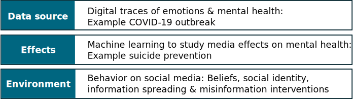
```

???
tool that allows measuring things that we could not measure otherwise
Macroscopes: emotion measures at the level of populations

Framing: My research focuses on digital tools for assessing and changing health behaviours including eating behaviour. Furthermore, I am studying the influence of the physical and social environment on health behaviours. My work is rooted in Open Science principles and I actively engage in science communication.git 

---

# Computational social science

### Social media as a data source
```{r, echo=FALSE, out.width=1000, fig.align='center'}
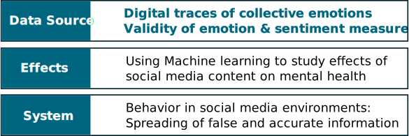
```

---
layout: true
<div class="my-footer"><span>
<a href="https://psyarxiv.com/qejxv"> Metzler, Rimé, Pellert, Niederkrotenthaler, Di Natale & Garcia (2023) Emotion. </a></span></div>

---

# Collective emotions during COVID-19

.pull-left[
**Social media data**
* Emotional expressions on Twitter
* 5 weeks after outbreak in 2020
* 8,3 billion tweets in 6 languages
* Geolocation: 18 countries

**Computational Methods**
* Automated text-analysis
* Validated emotion dictionaries
* Robustness: Machine Learning
* GLMEMs
]

.pull-right[

```{r, echo=FALSE, out.width=600}
knitr::include_graphics("figures/EmotionTimelines2020_Italy.svg")
```
]


???

ML: Deep learning: RoBERTa fine-tuned to tweets
Generalized Linear Mixed Effect Models
After image: link to stringency and cases in plot: association with real world events

---

# Measure stringency & COVID cases

.pull-left[.center-left[
```{r, echo=FALSE, out.width=460}
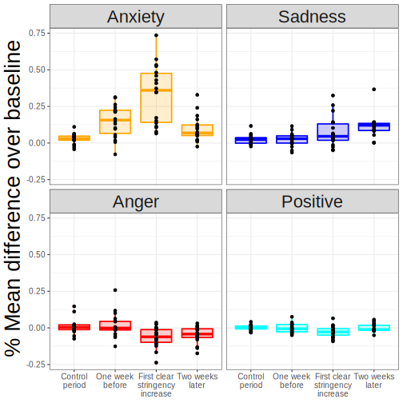
```
]]

.pull-right[.center-right[
```{r, echo=FALSE, out.width=400}
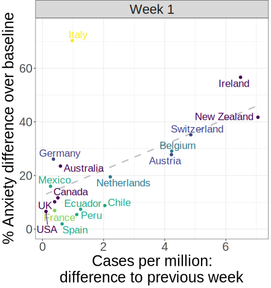
```
]]

---
layout: true
<div class="my-footer"><span>
<a href=https://arxiv.org/abs/2107.13236> Garcia, Pellert, Lasser, Metzler. arXiv (2021) - </a>
<a href=https://www.nature.com/articles/s41598-022-14579-y> Pellert, Metzler, Matzenberger & Garcia. Scientific Reports (2022) </a></span></div>

---

# Validity of emotion measures

.pull-left[.center-left[
* UK Twitter data
* YouGov: Weekly representative UK emotion survey
* 2 year period

* Automated text-analysis & Machine Learning
* Pre-registered hypotheses for prediction period
]]
.pull-right[.center-right[
```{r, echo=FALSE, out.width=650, fig.align='right'}
knitr::include_graphics("figures/Anxiety.svg")
```

```{r, echo=FALSE, out.width=650, fig.align='right'}
knitr::include_graphics("figures/Sadness.svg")
```
]]

* Sentiment analysis in Austria: similar results

???
---
layout: true

---
# Computational social science
### Effects of social media

```{r, echo=FALSE, out.width=1000, fig.align='center'}
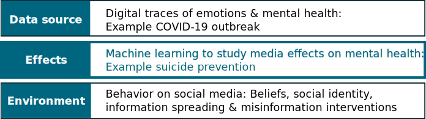
```

---
layout: true
<div class="my-footer"><span> 
<a href="https://www.jmir.org/2022/8/e34705"> Metzler, Baginski, Niederkrotenthaler & Garcia (2022) JMIR </a></span></div>

---

# Media effects research on suicide

News reporting on suicide influences suicidal behavior in individuals at risk

.pull-left[.center-left[
```{r, echo=FALSE, out.width=250, fig.align='center'}
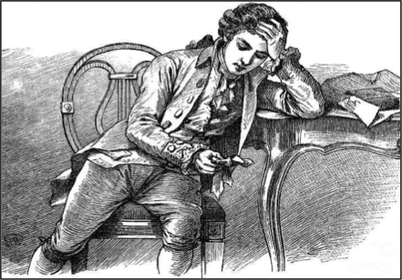
```

<div style="text-align:center">
Reports on suicide deaths: <br>
<span style="font-weight: bold; color:#1f5c99"> Werther</span> effect <br>
<font size="4">
<a href='https://www.bmj.com/content/368/bmj.m575'> Meta-analysis: Niederkrotenthaler et al. 2020 </a>
</font> </div>

]]

.pull-right[.center-right[

```{r, echo=FALSE, out.width=200, fig.align='center'}
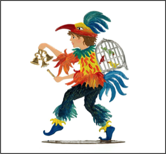
```

<div style="text-align:center">
Stories of hope & coping: <br> 
<span style="font-weight: bold; color:#1f5c99"> Papageno</span> effect  <br> 
<font size="4">
<a href='https://www.doi.org/10.1192/bjp.bp.109.074633'> (e.g. ) Niederkrotenthaler et al. 2010 </a>
</font> </div>
]]

<div style="text-align:center; font-weight: bold; color:#1f5c99"> Content, language & emotional connotation matter </div>

---


## Machine learning classification of harmful & protective content

.pull-left[
* Social media content on suicide
* Big data for robust results
* 14.5 million US tweets 2013-2020
]
--
.pull-right[
* Scheme: typical content categories
* Artificial Intelligence: <br>
Traditional ML & Deep Learning
]

--
```{r, echo=FALSE, out.width=1000, fig.align='center'}
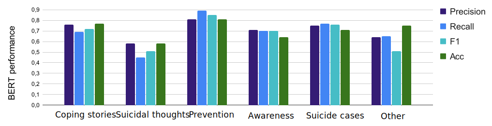
```

???
Social media: young adults and new content types, but few studies
Small datasets with manual labelling: Big data
Best performance with BERT
* Prevention: Model detects 90%
* Suicidal thoughts: Model misses many - sarcastic messages
* State-of-the art performance <span style="font-size: 18px"><a href='https://www.sciencedirect.com/science/article/pii/S2468696417300605'> Burnap et al. (2017) </a> </span>


---
layout: true
<div class="my-footer"><span> 
<a href="https://doi.org/10.1177/00048674221126649"> Niederkrotenthaler, Tran, Baginski,..., & Metzler (2023). Australian & New Zealand Journal of Psychiatry. </a></span></div>

---

## Associations with suicides & helpline calls

* Daily volume of tweets per category: Time series in the US
```{r, echo=FALSE, out.width=830, fig.align='left'}
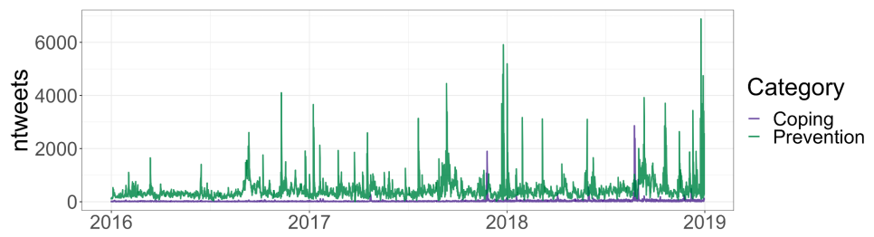
```

* Time series analysis with daily suicide cases & helpline calls
* Suicide cases in general: no association 
<span style="font-size: 18px"><a href='https://www.doi.org/10.1192/bjp.bp.109.074633'> (confirming Niederkrotenthaler et al. 2020) </a> </span>
* Coping stories: protective association with calls, but are rare
* Prevention tweets: protective association with cases & calls

---
layout:true

---

# Computational social science
### Social media as a system
```{r, echo=FALSE, out.width=1000, fig.align='center'}
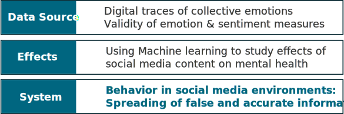
```

---
# Emotional misinformation spreading

.left-column[
```{r, echo=FALSE, out.width=350, fig.align='center'}
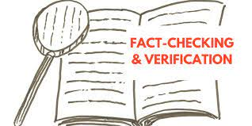
```

<br> <br> <br><br> 

```{r, echo=FALSE, out.width=120, fig.align='left'}

```
<span style="font-size: 25px">PI of Digital Humanism project, 400k </span> 
]

.right-column[
* Current interventions focus on accuracy <br>
* Fake news and conspiracies increase during crisis
* Emotions increase sharing
]


```{r, echo=FALSE, out.width=850, fig.align='left'}
knitr::include_graphics("figures/Emomis.svg")
```

---
layout: true
<div class="my-footer"><span>
<a href=https://doi.org/10.31234/osf.io/udqms> Lühring, J., Shetty, A., ..., Metzler, H. (2023). PsyarXiv (2023)</a></span></div>

---

# Slide on emotion paper

---

# Health beliefs: Social identity intervention

* Picture homeopathy


---
layout:true
<div class="my-footer"><span>
<a href=https://doi.org/10.31234/osf.io/cxa9u> Metzler & Garcia (2023). Perspectives on Psychological Science (2023)</a></span></div>

---

## Social drivers and algorithmic mechanisms on digital media


---

# Conclusions
.left-column[
<br>
**Data source**
<br> <br> <br><br> <br> 
**Effects of media content**
<br> <br> <br>
**System**
]

.right-column[
* Emotions and mental health at collective level


* Media content effects real-world behavior

* Leveraging social idendity motives for openness to corrective health information
]

---

# Thank you!

<br>

For more on my research: https://hannahmetzler.eu

For data and code: https://github.com/hannahmetzler

Slides: https://hannahmetzler.eu/HMResearchSummary

<br>

```{r, echo=FALSE, out.width=220}
knitr::include_graphics("figures/csh.png")
```
```{r, echo=FALSE, out.width=220}

```
```{r, echo=FALSE, out.width=300}
knitr::include_graphics("figures/wwtf.svg")
```
```{r, echo=FALSE, out.width=260}

```